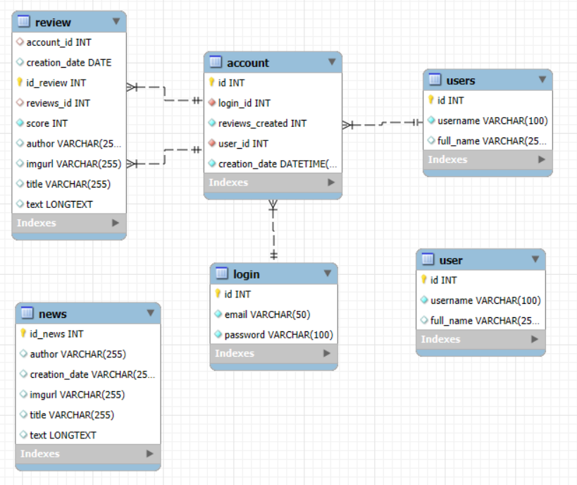
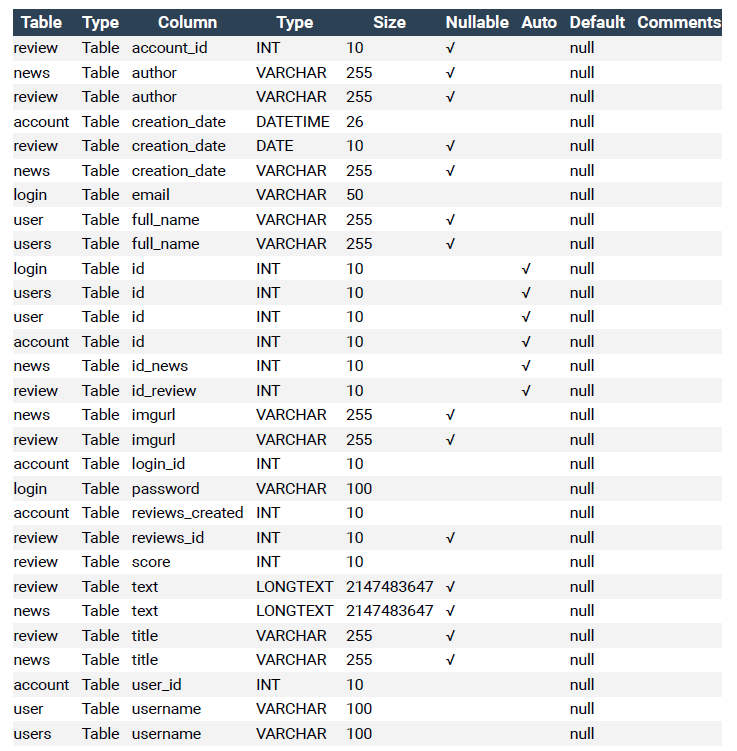
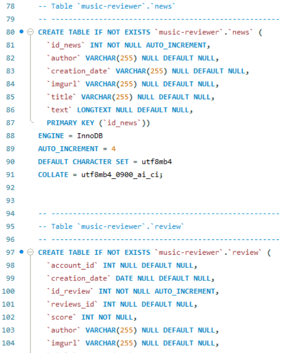

SYSTEM INTEGRATION  
10a \- Documenting a database  
by Muhammad Ali Khan

I chose to document a MySQL database that is called music-reviewer and contains album reviews and other relevant data. I produced the following artefacts:

1) ERD  
2) HTML documentation with SchemaSpy  
3) Database dictionary  
4) Schema DDL

Below is the ERD diagram, made via Workbench and its reverse engineering function:

I also created an auto-generated HTML documentation using the tool SchemaSpy. You would normally keep a database documentation private, but in this specific case i have put on github pages instead of showing images, for demonstration purposes:

[https://m-k1234.github.io/10a/](https://m-k1234.github.io/10a/) 

Via the HTML documentation its possible to save a database dictionary under the tables section. Below is an image of dictionary in pdf format:

Lastly i used workbench to forward engineer a DDL script:

